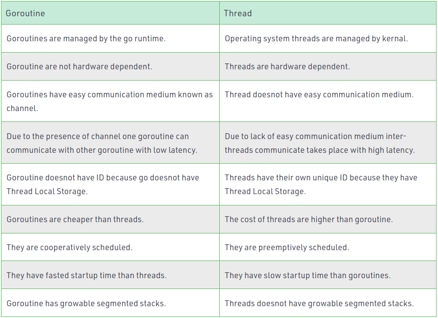
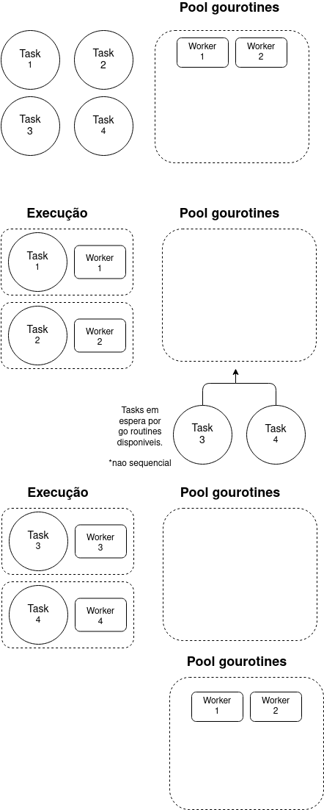

# Pool goroutine



## 🧰 Instalação

### v1

``` powershell
go get -u github.com/panjf2000/ants
```

### v2

```powershell
go get -u github.com/panjf2000/ants/v2
```

## 🛠 How to use

``` go

import (
	"fmt"
	"github.com/poolGoRoutine/exemplo6"
	"github.com/poolGoRoutine/exemplo7"
	"os"
	"runtime"
	"sync"
	"testing"
	"time"

	"github.com/panjf2000/ants"
)

const (
	_   = 1 << (10 * iota)
	KiB // 1024
	MiB // 1048576
)

const (
	poolSize = 1000
	jobSize = 10000
)

var curMem uint64

func TestPoolWithFuncWaitToGet(t *testing.T) {
	start := time.Now()
	//Cria a waitGroup 
	var wg sync.WaitGroup
	//Cria uma pool de 1000 goroutine com uma função pre estabelecida
	p, _ := ants.NewPoolWithFunc(poolSize, func(i interface{}) {
		exemplo6.ApiWorker(i)
		//Apos a execução deixa a goroutine como disponivel
		wg.Done()
	})
	//Defer para release na pool
	defer p.Release()

	for i := 0; i < jobSize; i++ {
		//Adiciona a goroutine ao sync
		wg.Add(1)
		//Invoca a pool com as goroutines
		_ = p.Invoke(i)
	}
	//Coloca em espera ate finalizar todas as goroutines
	wg.Wait()
	fmt.Printf("pool go routine, workers:%d", p.Running())
	mem := runtime.MemStats{}
	runtime.ReadMemStats(&mem)
	curMem = mem.TotalAlloc/MiB - curMem
	fmt.Printf("\n%.2fs elapsed\n", time.Since(start).Seconds())
	fmt.Printf("memoria usada:%d MB", curMem)
}

func TestPoolWaitToGetWorker(t *testing.T) {
	start := time.Now()
	//Cria a waitGroup 
	var wg sync.WaitGroup
	// Cria uma pool de 1000 goroutine
	p, _ := ants.NewPool(poolSize)
	//Defer para release na pool
	defer p.Release()

	for i := 0; i < jobSize; i++ {
		//Adiciona a goroutine ao sync
		wg.Add(1)
		//Delega a função para as goroutines na pool
		_ = p.Submit(func() {
			exemplo7.ApiWorker()
			//Apos a execução deixa a goroutine como disponivel
			wg.Done()
		})
	}
	//Coloca em espera ate finalizar todas as goroutines
	wg.Wait()
	fmt.Printf("pool go routine, workers:%d", p.Running())
	mem := runtime.MemStats{}
	runtime.ReadMemStats(&mem)
	curMem = mem.TotalAlloc/MiB - curMem
	fmt.Printf("\n%.2fs elapsed\n", time.Since(start).Seconds())
	fmt.Printf("memoria usada:%d MB", curMem)
}
```

### Mude a capacidade da pool em tempo de execução

``` go
pool.Tune(1000) 
pool.Tune(100000) 
```

*thread-safe.

### Pre-malloc goroutine 

```go
// ants vai pre alocar toda a capacidade da pool quando o metodo for invocado
p, _ := ants.NewPool(100000, ants.WithPreAlloc(true))
```

### Reiniciar a pool

```go
pool.Reboot()
```

## Memory Leak

Quando se trata de gerenciamento de memoria Go trata de muitas coisas por voce, o compilador Go decide aonde os valores são alocados na memoria usando a estrategia "escape analysis". Em tempo de execução, são trackeados e gerenciado os heaps de alocações fazendo o uso do garbage collector. Embora não é impossivel criar vazamento de memoria nas suas aplicações, as chances são bastantes reduzidas.

Goroutines é um tipo comum de vazamento de memoria. Se voce startar uma Goroutine, voce espera que eventualmente termine mas nunca acontece e com isso acontece vazamento de memoria. A Goroutine tem o ciclo de memoria igual ao da aplicação e qualquer memoria alocada para Goroutines não pode ser released. Nunca comece uma Goroutine sem saber como ela vai parar.

Para prevenir tais eventualidades podemos usar WaitGroups. Para cada gorountine utiliza-se o waitGroup.Add(i), i podendo adotar -1, 0 ou 1, waitGroup.Done() e waitGroup.Wait(). 

```go
package main

import (
    "fmt"
    "sync"
    "time"
)

func worker(id int, wg *sync.WaitGroup) {
    defer wg.Done()
    
    fmt.Printf("Worker %d starting\n", id)
    time.Sleep(time.Second)
    fmt.Printf("Worker %d done\n", id)
}

func main() {
    var wg sync.WaitGroup
    
    for i := 1; i <= 5; i++ {
        wg.Add(1)
        go worker(i, &wg)
    }
    
    wg.Wait()
}
```

## Testes Goroutine X Ants 
```powershell
// 100000 JOBS

//------- No pool and ants
TestNoPool: poolGoRoutine_test.go:300: memory usage:1482 MB
26648 milliseconds elapsed -- 26 seconds

//------- With ants, native pool ants
25740 milliseconds elapsed -- 26 seconds
TestAntsPool: poolGoRoutine_test.go:315: pool, capacity:2147483647
TestAntsPool: poolGoRoutine_test.go:316: pool, running workers number:1580
TestAntsPool: poolGoRoutine_test.go:317: pool, free workers number:2147482067
TestAntsPool: poolGoRoutine_test.go:322: memory usage:1502 MB

//------- With ants, with a setted pool 10000
32453 milliseconds elapsed -- 32 seconds
TestAntsPoolGo: poolGoRoutine_test.go:338: pool, capacity:10000
TestAntsPoolGo: poolGoRoutine_test.go:339: pool, running workers number:5029
TestAntsPoolGo: poolGoRoutine_test.go:340: pool, free workers number:4971
TestAntsPoolGo: poolGoRoutine_test.go:345: memory usage:1196 MB

//------- With ants, with a setted pool 1000
301014 milliseconds elapsed -- 301 seconds
TestAntsPoolGo: poolGoRoutine_test.go:343: pool, capacity:1000
TestAntsPoolGo: poolGoRoutine_test.go:344: pool, running workers number:1000
TestAntsPoolGo: poolGoRoutine_test.go:345: pool, free workers number:0
TestAntsPoolGo: poolGoRoutine_test.go:351: memory usage:796 MB
```

## Conclusão
Usando a lib ants o processo de implementação da pool bem como a manutenção facilitam mais a implementação do que a opção de workers nativamente, dado que para a implementação dos workers nativamente talvez seja necessario a alteração da função para o uso. E mostra-se tambem uma melhor performace e com menos consumo de memoria. 
